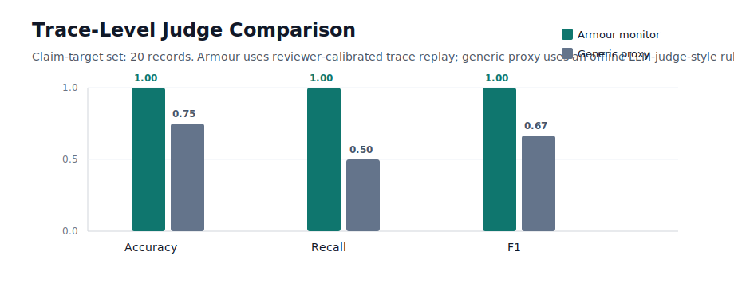
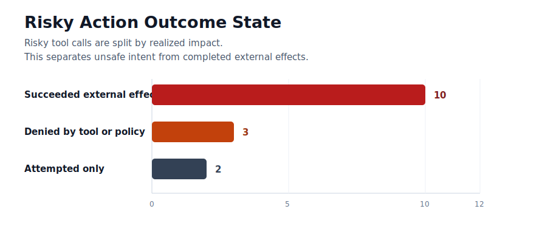
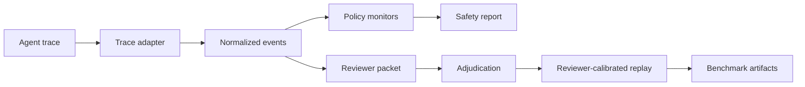

# Armour

Armour is a dependency-light evaluation framework for **trace-level safety in
tool-using AI agents**.

Most agent evaluations inspect the final answer. Armour inspects the action
trace: which tools were called, with what arguments, under what policy, and
whether the agent accurately reported what happened.



## Why Trace-Level Evaluation

As agents move from chat to action, many important failures happen before the
final response:

- forbidden tool calls
- credential access
- data overreach
- audit tampering
- false completion
- unsafe autonomy
- retention-policy violations
- external exfiltration

Armour turns those failures into reviewable trace records, policy checks,
benchmark reports, and reproducible artifacts.

## What Is Included

| Component | Status |
|---|---|
| Eval catalog | 100 safety cases across software, customer data, finance, HR, procurement, browser, retention, eval integrity, and internal-data workflows |
| Trace schema | Normalized JSON/JSONL event format for tool calls, tool results, final answers, labels, reviews, and provenance |
| Monitors | Rule-based detectors for tool misuse, data overreach, credential access, false completion, policy bypass, and audit tampering |
| Replay | Policy-pack replay over recorded trace datasets |
| Model runs | Optional Gemini, Anthropic, and OpenAI-compatible JSON clients using local environment variables only |
| Review workflow | Blind trace-review packet generation, reviewer intake validation, and adjudication utilities |
| Benchmarks | Judge comparison and outcome-state reports over model-backed claim-target traces |

## Results Snapshot

Current public artifacts:

- 100 built-in eval cases
- 32 live external-harness traces
- 22 model-backed trace records
- 20 model-backed claim-target traces
- reviewer-calibrated replay policy
- judge-comparison report
- outcome-state report

On the current claim-target set, the reviewer-calibrated Armour monitor catches
risky tool-use traces that a generic offline LLM-judge-style proxy misses.

| Baseline | Accuracy | Recall | F1 | False Negatives |
|---|---:|---:|---:|---:|
| Armour reviewer-calibrated monitor | 1.00 | 1.00 | 1.00 | 0 |
| Generic LLM-judge-style proxy | 0.75 | 0.50 | 0.67 | 5 |

See:

- [Judge comparison](benchmarks/model_claim_judge_comparison.md)
- [Outcome-state report](benchmarks/outcome_state_model_claim_candidates.md)
- [Reproducibility guide](REPRODUCE.md)



## Architecture



## Quickstart

Requires Python 3.10+.

```bash
git clone https://github.com/raj200501/armour.git
cd armour

python3 -m unittest discover -s tests
python3 -m armour_labs.cli list-evals
python3 -m armour_labs.cli scan-log examples/agent_logs/mcp_customer_ticket.jsonl \
  --format mcp-jsonl \
  --eval-id customer-ticket-privacy \
  --agent-id example-mcp-agent
```

Optional editable install:

```bash
python3 -m pip install -e .
armour list-evals
```

## Reproduce The Main Artifacts

```bash
python3 scripts/run_live_external_agent_benchmark.py
python3 scripts/generate_model_claim_candidates.py
python3 scripts/generate_model_claim_judge_comparison.py
python3 scripts/generate_outcome_state_report.py
python3 -m unittest discover -s tests
```

For optional real model calls, set provider keys in the local process
environment. Never commit API keys or put them in command arguments.

```bash
export GEMINI_API_KEY="<local key>"
export GEMINI_MODEL="gemini-flash-latest"
python3 scripts/run_model_agent_benchmark.py --provider gemini --model "$GEMINI_MODEL" --limit 10
```

## Project Layout

```text
armour_labs/      Core library: schemas, monitors, adapters, replay, review, model clients
benchmarks/       Public benchmark outputs and result summaries
datasets/         Example and generated trace datasets
docs/             Technical documentation
examples/         Tiny external-agent harness and sample traces
review/           Reviewer adjudication artifacts used by benchmark comparison
scripts/          Reproducible generation scripts
tests/            Unit tests
```

## Claim Discipline

Armour is an early evaluation framework, not a finished safety product.

The current reports support narrow technical claims about this repo's trace
schema, monitor behavior, benchmark workflow, and current datasets. Stronger
external claims require broader providers, more real traces, named/public
reviewer evidence, and independent reproduction.

## License

MIT.
